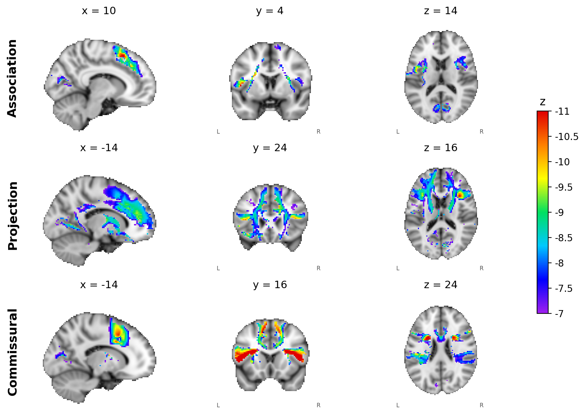

# Functionnectome analysis: stop-signal preliminary study and working-memory pre-registered study

Code for a pre-registered Functionnectome study. The stop-signal analysis is the completed preliminary study. The
pre-registered working-memory analysis runs through the same scripts with the task label changed.



White-matter group z-maps, successful stop > unsuccessful stop (n = 217), association, projection and commissural priors, z < −7.

## Repository structure

```
01_greymatter_glm/       Grey-matter GLM (SPM12), first and group level
02_template_and_route/   Template correction and Functionnectome input
03_greymatter_mask/      Group grey-matter mask
04_coverage/             Field-of-view coverage
05_projection/           Functionnectome projection and projected GLMs
06_atlas/                XTRACT tract atlas
07_tract_readout/        Tract regression and tract tests
08_simulation/           Sensitivity of the H1 and H2 tests
figures/                 README figure
environment/             Python requirements
set_paths.sh             Paths
```

## Data and external files

- AOMIC PIOP2 (Snoek et al., 2021), OpenNeuro `ds002790`
- Functionnectome priors (Nozais et al., 2023)
- XTRACT atlas, releases 2.0.0 and 1.2.0
- XTRACT protocols, `xtract_data` repository, commit b7723aa
- HCP Pipelines v6.0.0, `FreeSurferSubcorticalLabelTableLut.txt`
- colldiag, github.com/brian-lau/colldiag, commit f5a0c2b

## Software

Python 3.13.5, MATLAB R2021a with SPM12 (revision 7771) and the Statistics and Machine Learning Toolbox, FSL 6.0.5, FreeSurfer 7.2.0.

## Licence

MIT, see `LICENSE`.
